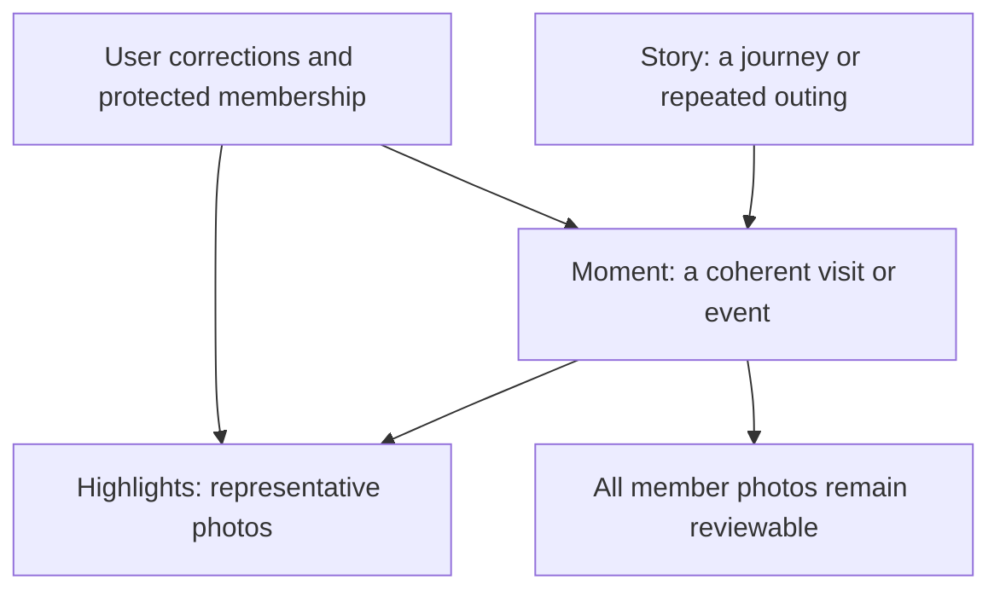
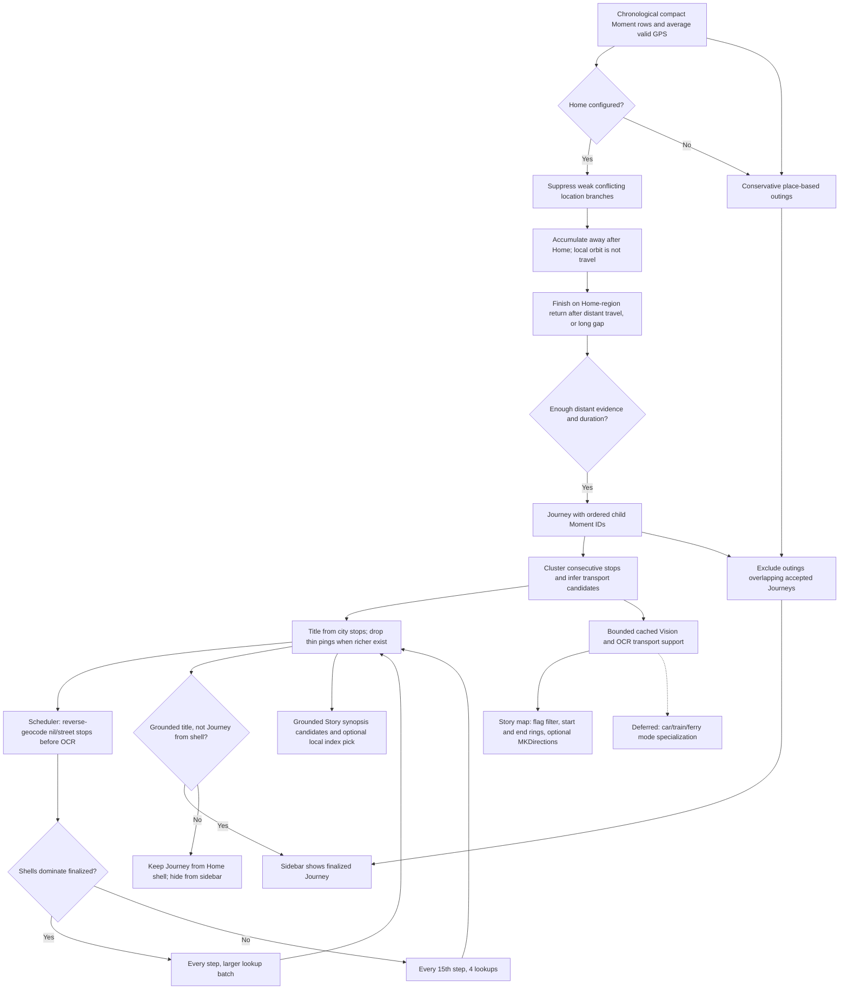
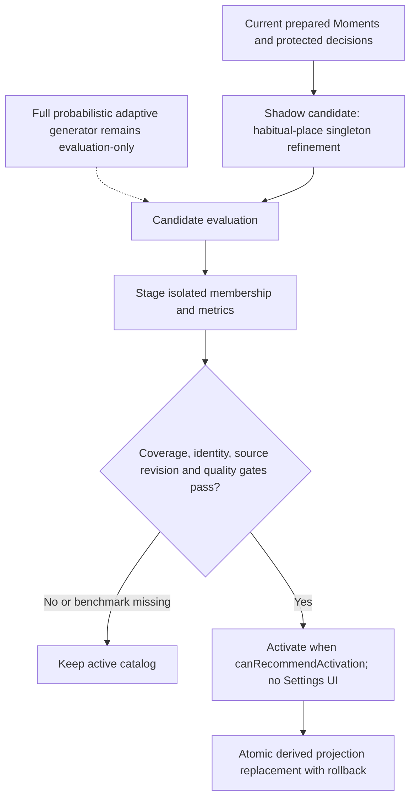
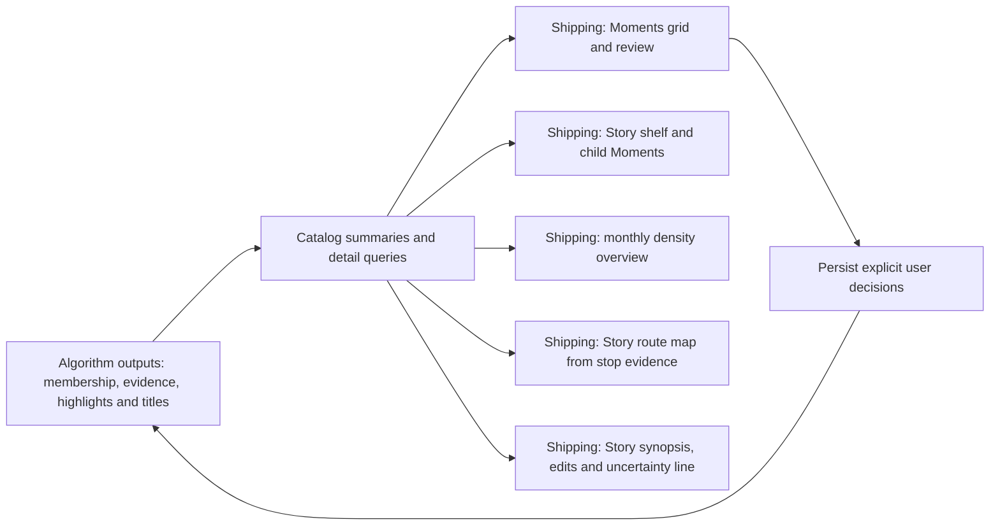

# Curation algorithm: living map

Audited against the working tree on 2026-09-28. This is the navigation and status
authority for the algorithm. Historical phase documents explain its development;
source and runnable checks establish actual behavior. A passing test of a helper
does not mean that helper is connected to the shipping pipeline.

## Product hierarchy

These are different decisions: which photos belong together, which Moments tell
one larger story, and which photos best represent it. A large Vatican visit may
remain one Moment; several cities may belong to one journey. Photo count alone
does not establish an event boundary. Quiet periods are not unimportant periods.

## Adaptive evidence (shipping)

A clean-room library mixes rich modern captures with sparse older ones. Shipping
curation must produce a consistent Story → Moment → Highlight catalog without
waiting for the most expensive tool on every photo.

| Photo situation | Prefer first | Escalate when needed |
| --- | --- | --- |
| Recent captures with time + GPS (and other PhotoKit attributes) | Cheap metadata: day/time gaps, distance, Home geofence, album outlines; reverse-geocode Journey stops | Vision / OCR / labels only after thin backlog clears, or immediately on viewport focus |
| Older captures (pre-2010) with weak or missing geotags | Still form Moments from time when possible | Higher-priority local Vision, OCR, and scene evidence (runs first, priority 80) |
| Modern no-GPS ordinary photos | Still form Moments from time when possible | Priority 65 Vision/OCR (ahead of GPS-rich refinement) |
| Dedicated still camera / RAW, no GPS | Time-only Moments; GPS will not appear later | Priority 80 Vision/OCR (same band as pre-geotag). Device class from EXIF/UTI, not a family roster |
| Modern no-GPS bursts / animated / Live Photos | Metadata + category signals | Mid-band priority 45 — still ahead of GPS-rich (≤35), behind ordinary thin work |
| Screenshots, utility, habitual/home clutter | Metadata + category signals | Skip OCR in the soak text queue; keep out of Journey-quality Stories unless evidence supports otherwise |

Base Moments from time/location are browseable immediately (`grouping_state`
`conservative` or better). Visual segmentation upgrades membership when evidence
arrives; it must not leave cards on “Preparing grouping…”. Stories (Journey,
outing, and later memory / habitual classes) build on those Moments as evidence
allows. Expensive analysis is scheduled by attribute thinness
([AdaptiveEvidenceScheduling.swift](../Sources/PhotoCurator/AdaptiveEvidenceScheduling.swift)):
missing GPS and pre-geotag-era photos outrank recent GPS-rich captures. GPS-rich
jobs at or below `refinementMaxPriority` are **deferred** (unclaimed) while any
higher-priority analysis remains; the soak OCR lane also skips them. Reordering
alone is not enough — the queue must not treat “fill every missing Vision/OCR
cache” as equal work. One scheduler and one `CuratorWorker` writer remain; each
analysis step may claim up to three thin Vision/thumbnail lanes
(`AnalysisLaneBudget`, thermal/low-power drops to 1). Do not add more SQLite
actors. `prepareMoments` still turns finished Vision into scene splits and
highlights. Viewport focus still boosts priority above attribute scores
and can claim refinement immediately. Bounded Journey stop geocoding runs **before**
the OCR interleave on the same scheduler cadence so GPS-rich Journeys are not stuck
on `Journey from Home` until Vision finishes. When shells dominate finalized titles
(post-wipe recovery), geocode runs every analysis step with a larger batch instead
of the normal every-15 cadence.

## Shipping flow

Solid arrows below describe current dependencies, not one blocking batch. The
scheduler revisits incomplete work as evidence becomes available. Browsing does
not have to wait for the whole library to finish.

Implementation anchors:

| Stage | Source and entry point | Relevant checks |
| --- | --- | --- |
| Base membership | [CuratorModels.swift](../Sources/PhotoCurator/CuratorModels.swift), `MomentGrouping.group`; [MomentCatalogGrouping.swift](../Sources/PhotoCurator/MomentCatalogGrouping.swift), `build` | `MomentCatalogGroupingTests`, `MomentMergeTests` |
| Continuity and segmentation | [CuratorController.swift](../Sources/PhotoCurator/CuratorController.swift), `preparedCatalog`, `prepareMoments`, `prepareGrouping`; [AutomaticMomentSegmentation.swift](../Sources/PhotoCurator/AutomaticMomentSegmentation.swift); [MomentContinuity.swift](../Sources/PhotoCurator/MomentContinuity.swift) | `AutomaticMomentPipelineTests`, `MomentContinuityTests`, `LargeMomentWindowsTests` |
| Evidence acquisition | [AdaptiveEvidenceScheduling.swift](../Sources/PhotoCurator/AdaptiveEvidenceScheduling.swift); [CuratorVisionAnalyzer.swift](../Sources/PhotoCurator/CuratorVisionAnalyzer.swift); controller `runAnalysisStep`, `prepareText`; [MomentTextEvidence.swift](../Sources/PhotoCurator/MomentTextEvidence.swift) | `AdaptiveEvidenceSchedulingTests`, `CuratorVisionTests`, `AnalysisQueueTests`, `MomentTextEvidenceTests` |
| Highlights | Controller `prepareDisplaySelection`; [MomentSelection.swift](../Sources/PhotoCurator/MomentSelection.swift); [MomentDisplayEligibility.swift](../Sources/PhotoCurator/MomentDisplayEligibility.swift) | `MomentSelectionTests`, `BalancedSelectionTests`, `RepresentativeSelectionTests`, `ScenerySelectionTests` |
| Moment naming | [BackgroundMomentContext.swift](../Sources/PhotoCurator/BackgroundMomentContext.swift); [LocalMomentNarrative.swift](../Sources/PhotoCurator/LocalMomentNarrative.swift) | `BackgroundContextTests`, `LocalNarrativeTests`, `MomentCaptionEvidenceTests` |
| Story naming | [LocalStoryNarrative.swift](../Sources/PhotoCurator/LocalStoryNarrative.swift); [StoryNarrativeSheet.swift](../Sources/PhotoCurator/StoryNarrativeSheet.swift); Catalog `story_edits` | `LocalStoryNarrativeTests` |
| Story projection | [CatalogV2.swift](../Sources/PhotoCurator/CatalogV2.swift), `rebuildStories`, `needsStoryProjection`; [HolisticCurationGeneration.swift](../Sources/PhotoCurator/HolisticCurationGeneration.swift), `StoryHierarchyBuilder` | `CatalogV2Tests`, `HolisticCurationGenerationTests` |
| Photos publication folders | [PhotoKitAlbumAdapter.swift](../Sources/PhotoCurator/PhotoKitAlbumAdapter.swift); [CuratedPublication.swift](../Sources/PhotoCurator/CuratedPublication.swift); hierarchy `Photo Curator / Year / Story / Moment` | `CuratedPublicationTests` |
| Experimental unlocated Journeys | [ExperimentalUnlocatedJourney.swift](../Sources/PhotoCurator/ExperimentalUnlocatedJourney.swift) last-resort after GPS/outings in `StoryHierarchyBuilder` / `rebuildStories` | `ExperimentalUnlocatedJourneyTests`, `CatalogV2Tests.testRebuildStoriesCreatesExperimentalUnlocatedJourney` |

The base grouper currently uses same-day membership, an **adaptive per-day gap**
(median within-day gap × 8, clamped 30 minutes–3 hours; fallback two hours when a
day has no within-day pairs) and a 10 km distance bound when GPS exists. Full
`HolisticCurationGenerator` probabilistic boundaries remain evaluation-only (see
candidate section). Groups above 512 photos use bounded analysis windows;
that processing boundary must not be described as a product event-size limit.
Moments formed from capture time/location are immediately `conservative` (UI
grouping-ready). Vision/OCR may refine scene splits later; missing visual evidence
must not show “Preparing grouping…”. Large Moment windows follow the same rule.
Titles follow the same adaptive rule: date/place metadata titles persist first so
cards are not stuck on “Title preparation…”; Vision/OCR captions upgrade when
sampled evidence is ready. Grouping is projected into the catalog before captions
so a caption-only refresh cannot leave `grouping_state` stuck on preparing.
OCR timeouts and framework reader failures (`CRImageReaderError`, oversized
frames) cache empty text evidence and continue; they must not pause Moment
preparation overnight.

## Journey derivation and enrichment

`rebuildStories` persists GPS Journeys and place-based outings, then a
**last-resort experimental** pass for unlocated pre-2010 leftovers
(`story-projection-v55-unlocated-full-names`). Those Stories have empty stops —
no invented pins — and titles from season/year, away timezone, an owner Journey
album, and up to five people on that stretch by full Photos People name
(first and last): household first, then quieter guests (5% floor). Two people
who share a first name both stay. The whole pass runs only while Settings →
Experimental → “Use experimental extended access to Photos metadata” is on
(default on); turning it off re-projects Stories without these Journeys. Same-year same-season clusters rejoin after a rest of up to 8 days.
Sparse household-only months without an away timezone or Journey album stay out. Owner-album inject, Diagnostics Apply, and Keep-in-rebuilds
were removed from the GPS path. Offline helpers under `OwnerAlbumStoryReview` /
`UnlocatedAlbumStoryBuilder` remain for historical audits. The experimental pass
uses Photos.sqlite names/filenames/timezones when readable; those fields are not
guaranteed across macOS PhotoKit updates. If Moments
exist but `story_moments` is empty (cascade wipe / interrupted rebuild), or the
`storyProjectionEpoch` migration is missing after Journey-rule changes,
`needsStoryProjection` forces a rebuild on startup, sync, and summary reload.

Photos year-folder outlines still feed `AlbumOutlinePatterns` (nested place
folders, season buckets, bike outings, utility skips) used only for candidate
scoring.

Current rules in `JourneyStoryBuilder` and `JourneyTransportInference`:

- Conflicting observations within four hours and at least 250 km apart suppress
  the weaker route contribution only when photo support differs by at least 2:1.
- Distant travel must clear **100 km** from Home. Moments inside an **80 km Home
  orbit** (day trips, concerts, nearby towns) may bridge continuity but never
  become Journey stops and never glue separate abroad trips after a Home-region
  return. The Home geofence alone is too small for NL libraries (~50 m).
- A journey usually needs two distant observations and at least 36 hours of
  retained duration. A single ocean stay (California, already there) or a
  substantial Lviv-drive outing (Kraków, ≥10 photos, within 350 km of Home in
  Ukraine) still qualifies when it closes at Home. After two distant stops, a
  Home-region touch finishes the Journey only when it looks like a real return:
  distant travel does not resume within **three days**, and the Home touch is
  not a thin parallel household shot while distant GPS was recent (≤36 h). Home
  Moments a few km outside a tiny geofence (near-pin spill) still count as
  layovers for that bridge; farther Home-orbit outings (Badhoevedorp) still
  finish the prior abroad trip. Otherwise Grand Rapids → Panama stays one
  Americas circuit despite NL Home photos from the other phone.
- A gap of seven days or more between located members can finish a candidate, except
  when both sides of the gap are still an ocean away from every Home (Bay Area →
  Austin, Apr 2014), or when an ocean stay will resume after a non-ocean week
  (California → Azov → California, Jun–Nov 2013 — peel the Ukraine week). A
  Carpathian theater stay does not absorb a far Ukraine city (Yaremche →
  Mariupol / Odesa, Jan–Mar 2012). A single far-Ukraine city with a few photos
  is still its own Journey. Living at Home in Ukraine after a thin leftover
  (Sep 2010 Berlin, 4 photos) is not a Journey; unlocated home weeks do not
  glue that leftover to a later Yaremche ski outing. Home
  circles still attach with a **7-day** lookback before the first abroad stop and
  a **14-day** lookahead after the last (Crete 2023: NL GPS five days before,
  Home unlock 11 days after). An ocean hop may look **28 days** ahead (Dec 2013
  California → Lviv with Kraków split off in between). If departing GPS is
  missing, an assumed Home start is still drawn.
- Consecutive stops within 30 km are combined using photo-weighted centroids.
  Messenger GPS junk is dropped when it kinks the route (weak detour between two
  stronger stays), when a stop is labeled Home but is not near a mapped Home
  (mid-ocean “Home” pins), or when a Home label sits mid-route between destinations
  (merged Journeys must not draw Home → Michigan → Home → Panama).
- Air candidates require at least 400 km. Tight windows (30 minutes–12 hours with
  implied 180–1,100 km/h) get high confidence; when that fails, overland is tried
  next.   Multi-day gaps (over 12 hours, up to **28 days** when a mapped Home is an
  endpoint) count as air only for
  **≥ 2,000 km** intercontinental hops (Panama → Home; California → Home in
  Ukraine), not for European road
  distances. A return to Home in Ukraine after an ocean hop ends the Journey —
  a later Kyiv ping is leftover (Apr 2014), not a 40-day second-home bridge.
  A Carpathian weekend that returns to Lviv does not absorb the next ocean hop
  (Jan 2014 Bukovel is not a transatlantic airport). Lviv ↔ Munich is air when
  the US is on the route; Munich does not name that Journey. Dec 2013 flew
  California → Lviv (up to 28 days after the last Bay Area photo); Kraków is a
  separate Lviv car outing, not the ocean via. A California residency with a
  Ukraine week in the middle (Jun–Nov 2013 Azov) keeps one USA stay and peels
  the Azov trip as air from California; a leftover Carpathian day stays a Lviv
  drive; a thin Kyiv ping after Azov drops. Multi-day gaps under that distance with car-like average speed stay
  overland (Home → Fontainebleau, Bollène → Reims). A quiet week after the last
  abroad stop still counts as air when the next pin is Home and the hop is
  **≥ 1,000 km** (Bucharest → Home, Garraf → Home, Barcelona church → Home),
  even the same afternoon. A weekend NL ↔ Ivano-Frankivsk with no
  `Home in Ukraine` stop is also air (May 2015; do not title from Rynok Square).
  Ireland/UK ↔ Home is also air
  from **≥ 200 km** (Dublin → Home, London → Home) even on the same afternoon;
  that sea crossing is not a France-style drive. Home ↔ Berlin is air only when
  the hop is flight-shaped: same travel day (≤18 h) or a thin Berlin bookend
  (Jan 2016 Viechtach; May 2016 Gorzów overnight return). June 2015 drove
  NL ↔ Berlin (35 h after a real Berlin stay) — that stays overland. An assumed
  departing Home pin is not flight evidence. A Ukraine road trip that passes
  Berlin stays overland. Home ↔ Viechtach without a Berlin bookend stays
  overland.   Thin Hof / Sandersdorf pins on the Bavaria drive drop. A forest
  pin (Stanicki Las) is not a civil airport — drop it and do not mark the hop
  air. Fast air still needs a passenger-airport / Berlin-metro endpoint.
  Ukraine Home → Berlin with no NL bookend is a flight; NL → Berlin → Ukraine
  stays a drive.
  Overland legs stay under 1,000 km so a same-weekend flight is not drawn as an
  18-hour drive. A Home ↔ France hop under 1,000 km with a quiet week
  (Pampelonne → Home, 986 km) stays overland.
  Camera make/model and source UTI from PhotoKit are a device-class signal
  (phone vs dedicated still camera / RAW), not a hardcoded family roster.
  Dedicated-camera photos without GPS take the expensive Vision/OCR lane. Thin interior pins (≤4 photos)
  between two substantial stays — A7, motel, petrol, Warrington — are dropped; a
  mapped **Home** counts as a substantial neighbor so a thin UK ping before return
  Home can drop. A second residence (`Home in Ukraine`) is a real stay on a
  NL → Ukraine → Bukovel → Ukraine → NL drive (Jan 2022 and Jan 2018; assume the
  NL start when departing GPS is missing; keep Ivano-Frankivsk) — do not strip it as interior Home,
  and do not call the 1,450 km home-to-home hop air. A week already at Home in
  Ukraine before Košice starts the Hungary 2021 road trip there — do not invent
  NL → Slovakia. Košice titles as Slovakia. A stay at Home in Ukraine of up to
  **40 days** does not end a road trip if distant travel resumes (Dresden →
  Ukraine → Košice/Hungary is one 2021 drive; Carpathian weekends + Berlin
  in Jul–Aug 2019 is one drive home; NL → Berlin → Ukraine stay → Pylypets
  → NL in Jul–Aug 2018 is one drive). A single distant stop then the second
  home still stays open. Quiet weeks at the second home — including DSLR
  days with no GPS — do not close it.   NL ↔ Ukraine stays overland when the second home is on the route
  (Bukovel, Pylypets, Carpathian weekends). Kraków (~295 km) is a Lviv car
  outing, not an ocean via; California → Lviv after that outing is a separate
  one-way flight. A lone Ivano-Frankivsk weekend
  with no Ukraine Home stop uses the ≥1,000 km Home-bound air rule.
  Nov 2014 is one-way Home in Ukraine → Kyiv → NL: do not invent an NL start,
  and Kyiv → NL is air (Kyiv is the flight city, not a Carpathian drive).
  Aug 2014 Home in Ukraine ↔ Antalya ≥1,000 km is a flight; Muratpaşa does
  not name the Journey (`Summer holidays in Turkey`). A Carpathian weekend
  (Slavs'ka, Yasinya) starts at Home in Ukraine and keeps the village title.
  Only the primary NL Home ends it. Ukrainian street suffixes (`вулиця`) and national-park
  pins do not name the Journey. Do not invent a stop for an overnight with no GPS (Mâcon). Thin
  **air connections** stay: arrival airport after Home (Detroit before Grand Rapids),
  a Home-orbit departure airport (Schiphol, 25 km from Home) within 6 hours of a
  ≥400 km hop, or a hub ≥400 km from both rich stays (Atlanta between Michigan
  and Panama). Home is not merged with a nearby non-Home airport. Airport pins
  do not name the Journey. A brief inland ping after Home (<20 photos, ≤4 h,
  outside the Home orbit) on the way to a ≥400 km hop is dropped (Steigra before
  Rhodes, next hop ≥2,000 km) — that is not an airport hub. A same-day German
  stop on a drive to Bavaria stays. Other legs remain unknown.
- These are straight-line distance/time heuristics, not measured travel speeds
  or confirmed transport modes. Confidence values are fixed heuristics.
- Journey stop enrichment uses city/region labels only (never street/`item.name`
  fallbacks). Stops inside any mapped Home geofence resolve to that Home. Street
  and landmark labels are replaced by city geocode.   A single destination stays
  `Journey to {City}` (or `{Season} in {City}` when the stay is at least 10 days
  in one season), including a single-country village (Slavs'ka, Yasinya).   A Crete village (Ravdoucha) titles as **Crete**
  (`Summer holidays in Crete`), not the town.   Attraction pins (Mini-Europe, City of London School, Tibidabo church, Disneyland,
  Rynok Square, Münster Hbf, Tiergarten)
  title as the country or city (Belgium / United Kingdom / Spain / Paris / Ukraine /
  Germany / Berlin), not the park, school, church, square, station, or ride.
  A famous city name on the wrong continent is wiped (Brisbane, California → USA,
  not *Spring in Brisbane*).
- Several towns in one country collapse to that country: `{Season} holidays in {Country}`
  for a 5–24 day single-season trip, otherwise `Journey to {Country} in {Year}`.
  Two countries become `Journey to {A} and {B} in {Year}` (US box titles use **USA**).
  A NORAM + LATAM circuit (USA/Canada with Panama/Costa Rica/Colombia/Mexico) collapses to
  `Journey to Americas in {Year}` instead of listing both countries.
-   Country comes from a coarse coordinate box; ambiguous border points are skipped when a clear majority
  remains, otherwise the older city list (`Journey to` / `Journey via`) is used. Panama/Colombia
  overlap (San Blas) resolves to Panama. Portugal/Spain overlap (Lisbon/Caparica vs Badajoz)
  splits on the Guadiana (~-7.4°). Belgium/Netherlands/France overlap (Brussels)
  resolves to Belgium south of ~51.4° and west of ~5.6°; Lille stays France.
  Romania/Ukraine overlap at Yaremche resolves to Ukraine east of 24°.
  A Portugal + Greece week is one circuit when the owner flew
  both legs — Home hops ≥1,000 km stay air.
- Titles ignore secondary Home places (`Home in Ukraine`) and street/landmark labels;
  stops are ordered by photo support. Thin messenger pings (< 2 photos) are dropped
  from titles and from the route when stronger stays exist. Mapped Homes (Netherlands
  and Ukraine) can start or end a Journey; the map draws green/orange circles on
  those home anchors when home photos sit near the trip boundary. A return Home
  closes when the next located Moments after the last abroad stop are at Home
  (even a single photo), within about ten days — Panama → Home, not an open end.
  The map draws direction arrows on each leg; dashed purple = air, solid blue =
  overland, gray = unspecified.
- The Stories sidebar lists finalized Journeys, including seasonal names and saved
  renames. Unresolved `Journey from Home` shells stay in the catalog for enrichment
  but do not flicker in the side panel. Owners can rename a Journey, merge two or
  more, or run Refresh Journey Names to retitle from coordinates. Merges are stored
  in `story_merges` and reapplied when the same Moment set still matches; a Moment
  belongs to at most one Story (shared Home circles keep the newer Journey). merge
  application re-sanitizes concatenated stops so mid-route Home anchors disappear.
  Map flags filter the Moment grid (union).
- `rebuildStories` preserves prior non-street Journey stop place labels by rounded
  coordinates and retitles before persist, so Moments refresh must not wipe the
  finalized sidebar back to a single France-style outlier while shells refill.

Reverse geocoding names stops; it does not prove a route. It runs in bounded
cached batches on the analysis scheduler **before** the OCR interleave (every 15
steps normally; every step with up to 8 lookups while shells dominate finalized
titles), and again when local Vision/OCR catch up. It must not wait for the full
library cache to finish. Details and future scope are in
[Journey Stories](PHASE6_JOURNEY_STORIES.md).

`CatalogV2Store.enrichJourneyTransport` now inspects one leg per scheduler pass,
sampling at most the first 24 distinct member assets between the previous stop's
end and the next stop's start, with 30-minute shoulders. The worker reuses
revision-validated label and OCR caches, excludes screenshots, and requests no
pixels. Two photos must each have both a transport label and matching OCR phrase
with confidence at least 0.8 to increase the matching geometric confidence by 0.1.
Conflicting support prevents that increase; unknown modes remain unknown.
Persisted counts contain no raw OCR. An evidence compare-and-swap rejects stale
completion, and a complete sweep waits an hour before retrying. Missing caches
are revisited. Phrase coverage includes multilingual boarding, station, toll and
ferry wording (NL/DE/FR) plus ferry/bus/tram/boat Vision labels for overland bumps;
the label∧OCR AND-gate and ≥2-photo rule are unchanged. Absent matches are not
evidence against a mode. Car/train/ferry enum specialization remains deferred.
The sample can miss later clues in a dense travel leg.

Tests: `testLocalTransportSupportRequiresAgreementAndCannotChangeMode` and
`testTransportEnrichmentIsBoundedPersistedAndRejectsStaleCompletion`.

## Candidate changes: implemented but gated

`buildLatestCurationCandidate` currently refines the shipping baseline with
`refiningRoutineSingletons`; it does not replace it with the full probabilistic
adaptive generator. Shipping Moments already use shared `AdaptiveDayCadence` gaps
(median × 8, clamped). The routine pass buckets eligible singleton Moments by
habitual place, calendar month and everyday/reference role, respecting protected
decisions. Controller build, compare, activate, and rollback entry points remain,
but Settings no longer exposes them (removed 2026-10-05 with Diagnostics,
Reanalyze, and the storage summary; Reset stays).
Reviewed false-join and false-split measurements are still required for Activate;
the comparison weights false joins three times as heavily. Corpus coverage and
structural gates also apply. A clean-room reset alone does not enable this
candidate algorithm.

`ExperimentalUnlocatedJourneyBuilder` runs last in `StoryHierarchyBuilder` on
Moments not claimed by GPS Journeys or place outings. Seasonal titles count as
finalized sidebar Journeys. The pass is experimental and may lose sqlite signals
on a future macOS update.

`HierarchicalHighlightAllocator` runs during `rebuildStories`: Moment highlight
membership (`display_role=highlight`) feeds Story-level selection without rewriting
Moment selections. Story `highlight_count` and `cover_asset_id` come from the curated
Story set when highlights exist; otherwise they fall back to summed Moment counts.

## UI and algorithm development boundary

| Outcome | Algorithm status | UI status / next dependency |
| --- | --- | --- |
| Review events and highlights | Shipping pipeline | Grid, review and edits ship |
| Recognize multi-city journeys | Deterministic derivation ships | Story shelf ships; route map shows stop pins and transport legs |
| Explain transport | Distance/time candidates with bounded cached local support persisted | Map color/dash encodes mode; optional Apple Maps road paths behind Settings |
| Reduce routine singletons across days | Shadow refinement available | No UI (Settings Maintenance controls removed); Activate needs owner false-join/false-split benchmark |
| Select highlights across a Story | Allocator wired on `rebuildStories` | Sidebar shows Story highlight counts; dedicated Story highlight strip remains optional |
| Improve journey names | Grounded names and cached geocoding ship | Story summaries + grounded synopsis candidates; user title/synopsis edits preserved |

Publication to Photos or Google is a separate side-effect workflow after selection.
Photos albums are written under `Photo Curator / Year / Story / Moment`, where
Story is the Journey or Outing title prefixed with `yyyy-MM` for timeline order
within the year. Moments without a parent Story use a `Moments` folder. Publication
must not be mistaken for successful curation or used as a prerequisite for browsing.
Pagination and thumbnail requests may prioritize work, but must not define the
scope of library grouping. A full-library overview runs off the main thread; the
Moments grid and Story list stay scrollable while it runs. Workspace commands
sit in the window toolbar. Keep SwiftUI's native full-size title bar: its
safe-area top inset places All Moments and Journey titles below the toolbar.
Removing `fullSizeContentView` zeroes that inset while the host stays full
height, so content slides under the toolbar. Split views clamp to their parent without rewriting NSScrollView
frames (that clipped All Moments and Journey titles from the top). Inset repair
does not take pointer events. The Photos access bar leaves by itself once the
system dialog grants full access.

## Audit findings and next checks

The [2026-09-27 owner audit](JOURNEY_AUDIT_2026-09-27.md) preserved the 2020,
2022 and 2026 Journeys but found no confidence improvements: usable paired evidence
covered only 5.1% of sampled photo inspections. Pre-2007 yielded no Stories and no
usable paired evidence (historical observation). **Unlocated pre-2010 Stories ship as a last-resort experimental pass** (empty
stops, season merge, people titles). Offline album-audit helpers stay
evaluation-only. Invented GPS pins remain out of scope.

Follow-up: `modificationDate` includes metadata changes and currently contributes to
the analysis job revision string, so broad metadata edits can invalidate jobs. When
dimensions and adjustment fingerprints match, completed Vision results are now
adopted onto the new metadata revision instead of being cleared. OCR, label and
display evidence keys use `visualContentRevision` for the same reason. Stale queued
work still refreshes metadata instead of endlessly deferring. The index v4 queue
uses indexed capture dates, preserving priority/date order and completed results.
Old caches are not mass-relabelled. macOS 27 provides captions/keywords/original
filenames plus ratings; `addedDate` (macOS 26) and adjustment timestamps support
import-batch and revision diagnosis. No cloud-model enrollment was performed.

1. Candidate generation Activate remains gated on owner false-join/false-split
   benchmark counts; build/compare/rollback have no Settings UI. Hierarchical
   Story highlights ship on `rebuildStories` (count/cover).
2. Journey input averages GPS per Moment. Mixed locations and outliers within a
   large Moment can distort a stop; test this before claiming a detailed route.
3. The long-gap completion rule needs an explicit product decision and fixtures:
   is a closed journey allowed without an observed return Home?
4. Overland evidence does not yet distinguish car, train or ferry as separate
   modes; multilingual OCR may bump existing overland legs only.
5. Existing owner-audit totals are historical observations, not fresh validation
   of this documentation pass. Keep frozen family examples for Efteling,
   Amsterdam, the 2026 France journey and the 2022 road trip when evaluating changes.

## Maintenance contract

When changing grouping, selection, narrative, Journey logic, or their production
callers, update the affected diagram, source map, status and behavioral check in
the same change. Distinguish shipping, gated, disconnected and planned behavior.
When changing only presentation, update the UI table without implying an algorithm
change. Record a changed threshold and its rationale; retain historical audit
results with their date and corpus. Mermaid fences in this file are the canonical
diagram source and render on GitHub; do not maintain a separate hand-edited image.
