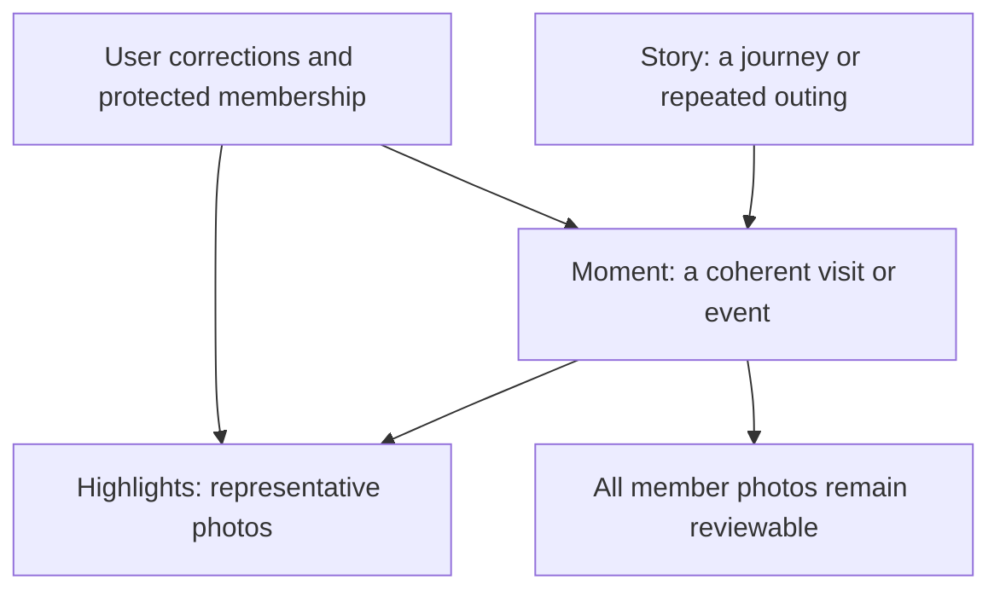
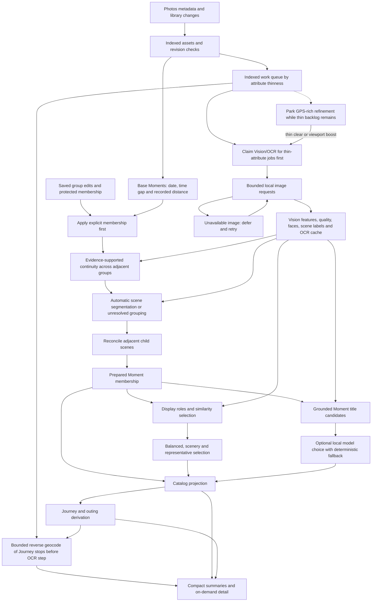
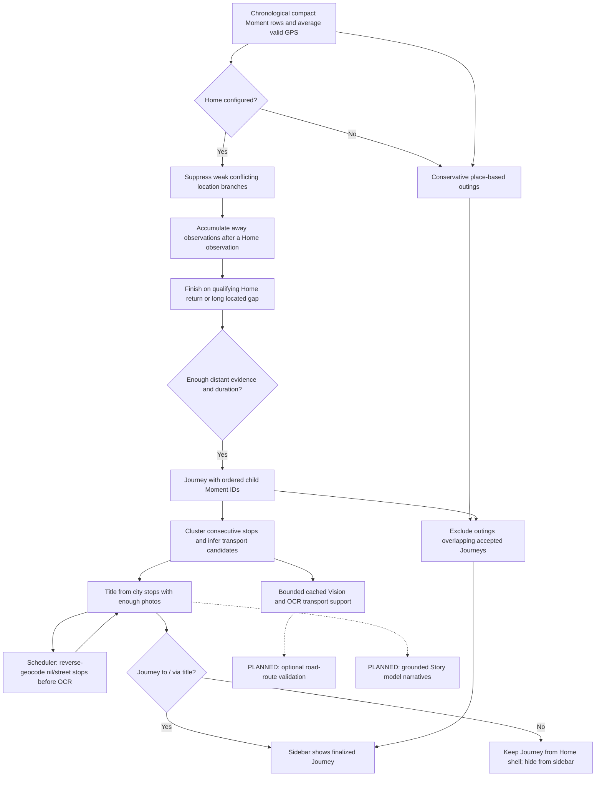
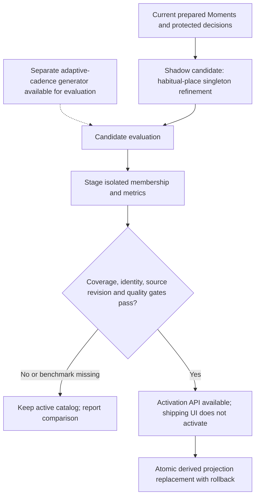
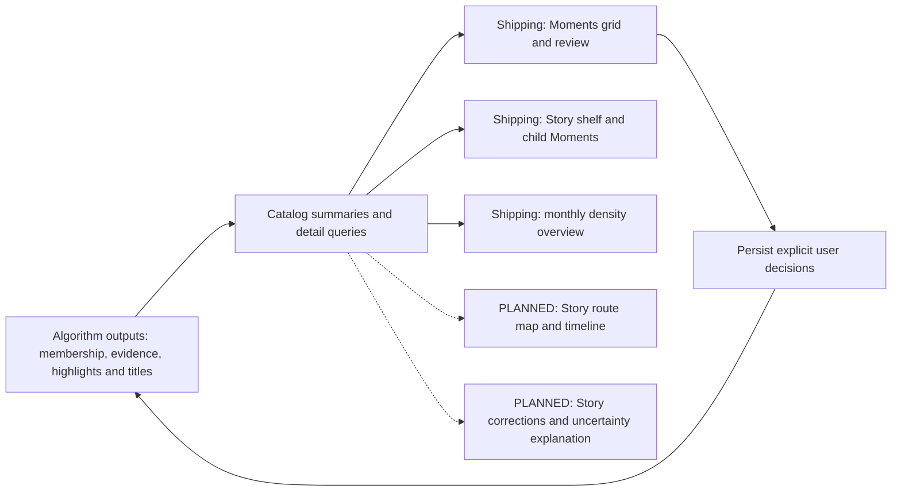

# Curation algorithm: living map

Audited against the working tree on 2026-09-28. This is the navigation and status
authority for the algorithm. Historical phase documents explain its development;
source and runnable checks establish actual behavior. A passing test of a helper
does not mean that helper is connected to the shipping pipeline.

## Product hierarchy

These are different decisions: which photos belong together, which Moments tell
one larger story, and which photos best represent it. A large Vatican visit may
remain one Moment; several cities may belong to one journey. Photo count alone
does not establish an event boundary. Quiet periods are not unimportant periods.

## Adaptive evidence (shipping)

A clean-room library mixes rich modern captures with sparse older ones. Shipping
curation must produce a consistent Story → Moment → Highlight catalog without
waiting for the most expensive tool on every photo.

| Photo situation | Prefer first | Escalate when needed |
| --- | --- | --- |
| Recent captures with time + GPS (and other PhotoKit attributes) | Cheap metadata: day/time gaps, distance, Home geofence, album outlines; reverse-geocode Journey stops | Vision / OCR / labels only after thin backlog clears, or immediately on viewport focus |
| Older captures (often pre-2007/2008) with weak or missing geotags | Still form Moments from time when possible | Higher-priority local Vision, OCR, and scene evidence (runs first) |
| Screenshots, utility, habitual/home clutter | Metadata + category signals | Skip OCR in the soak text queue; keep out of Journey-quality Stories unless evidence supports otherwise |

Base Moments from time/location are browseable immediately (`grouping_state`
`conservative` or better). Visual segmentation upgrades membership when evidence
arrives; it must not leave cards on “Preparing grouping…”. Stories (Journey,
outing, and later memory / habitual classes) build on those Moments as evidence
allows. Expensive analysis is scheduled by attribute thinness
([AdaptiveEvidenceScheduling.swift](../Sources/PhotoCurator/AdaptiveEvidenceScheduling.swift)):
missing GPS and pre-geotag-era photos outrank recent GPS-rich captures. GPS-rich
jobs at or below `refinementMaxPriority` are **deferred** (unclaimed) while any
higher-priority analysis remains; the soak OCR lane also skips them. Reordering
alone is not enough — the queue must not treat “fill every missing Vision/OCR
cache” as equal work. Viewport focus still boosts priority above attribute scores
and can claim refinement immediately. Bounded Journey stop geocoding runs **before**
the OCR interleave on the same scheduler cadence so GPS-rich Journeys are not stuck
on `Journey from Home` until Vision finishes.

## Shipping flow

Solid arrows below describe current dependencies, not one blocking batch. The
scheduler revisits incomplete work as evidence becomes available. Browsing does
not have to wait for the whole library to finish.

Implementation anchors:

| Stage | Source and entry point | Relevant checks |
| --- | --- | --- |
| Base membership | [CuratorModels.swift](../Sources/PhotoCurator/CuratorModels.swift), `MomentGrouping.group`; [MomentCatalogGrouping.swift](../Sources/PhotoCurator/MomentCatalogGrouping.swift), `build` | `MomentCatalogGroupingTests`, `MomentMergeTests` |
| Continuity and segmentation | [CuratorController.swift](../Sources/PhotoCurator/CuratorController.swift), `preparedCatalog`, `prepareMoments`, `prepareGrouping`; [AutomaticMomentSegmentation.swift](../Sources/PhotoCurator/AutomaticMomentSegmentation.swift); [MomentContinuity.swift](../Sources/PhotoCurator/MomentContinuity.swift) | `AutomaticMomentPipelineTests`, `MomentContinuityTests`, `LargeMomentWindowsTests` |
| Evidence acquisition | [AdaptiveEvidenceScheduling.swift](../Sources/PhotoCurator/AdaptiveEvidenceScheduling.swift); [CuratorVisionAnalyzer.swift](../Sources/PhotoCurator/CuratorVisionAnalyzer.swift); controller `runAnalysisStep`, `prepareText`; [MomentTextEvidence.swift](../Sources/PhotoCurator/MomentTextEvidence.swift) | `AdaptiveEvidenceSchedulingTests`, `CuratorVisionTests`, `AnalysisQueueTests`, `MomentTextEvidenceTests` |
| Highlights | Controller `prepareDisplaySelection`; [MomentSelection.swift](../Sources/PhotoCurator/MomentSelection.swift); [MomentDisplayEligibility.swift](../Sources/PhotoCurator/MomentDisplayEligibility.swift) | `MomentSelectionTests`, `BalancedSelectionTests`, `RepresentativeSelectionTests`, `ScenerySelectionTests` |
| Moment naming | [BackgroundMomentContext.swift](../Sources/PhotoCurator/BackgroundMomentContext.swift); [LocalMomentNarrative.swift](../Sources/PhotoCurator/LocalMomentNarrative.swift) | `BackgroundContextTests`, `LocalNarrativeTests`, `MomentCaptionEvidenceTests` |
| Story projection | [CatalogV2.swift](../Sources/PhotoCurator/CatalogV2.swift), `rebuildStories`, `needsStoryProjection`; [HolisticCurationGeneration.swift](../Sources/PhotoCurator/HolisticCurationGeneration.swift), `StoryHierarchyBuilder` | `CatalogV2Tests`, `HolisticCurationGenerationTests` |
| Photos publication folders | [PhotoKitAlbumAdapter.swift](../Sources/PhotoCurator/PhotoKitAlbumAdapter.swift); [CuratedPublication.swift](../Sources/PhotoCurator/CuratedPublication.swift); hierarchy `Photo Curator / Year / Story / Moment` | `CuratedPublicationTests` |

The base grouper currently uses same-day membership, a maximum two-hour gap and a
10 km distance bound when GPS exists. This is distinct from the adaptive-cadence
candidate generator below. Groups above 512 photos use bounded analysis windows;
that processing boundary must not be described as a product event-size limit.
Moments formed from capture time/location are immediately `conservative` (UI
grouping-ready). Vision/OCR may refine scene splits later; missing visual evidence
must not show “Preparing grouping…”. Large Moment windows follow the same rule.
Titles follow the same adaptive rule: date/place metadata titles persist first so
cards are not stuck on “Title preparation…”; Vision/OCR captions upgrade when
sampled evidence is ready. Grouping is projected into the catalog before captions
so a caption-only refresh cannot leave `grouping_state` stuck on preparing.
OCR timeouts and framework reader failures (`CRImageReaderError`, oversized
frames) cache empty text evidence and continue; they must not pause Moment
preparation overnight.

## Journey derivation and enrichment

`rebuildStories` persists GPS Journeys and place-based outings only. Owner-album
inject, Diagnostics Apply, and Keep-in-rebuilds were removed from the shipping
path. Offline helpers under `OwnerAlbumStoryReview` / `UnlocatedAlbumStoryBuilder`
remain for historical audits and tests; they do not write Stories. If Moments
exist but `story_moments` is empty (cascade wipe / interrupted rebuild),
`needsStoryProjection` forces a rebuild on startup, sync, and summary reload.

Photos year-folder outlines still feed `AlbumOutlinePatterns` (nested place
folders, season buckets, bike outings, utility skips) used only for candidate
scoring.

Current rules in `JourneyStoryBuilder` and `JourneyTransportInference`:

- Conflicting observations within four hours and at least 250 km apart suppress
  the weaker route contribution only when photo support differs by at least 2:1.
- A journey requires at least two distant observations, at least 50 km from Home,
  and at least 36 hours of retained duration. A brief Home observation may be
  bridged when distant evidence follows within a day.
- A gap over seven days between located members can finish a candidate. The open
  tail is not flushed at the end. Therefore the implementation is not strictly
  equivalent to requiring an observed Home return for every accepted journey.
- Consecutive stops within 30 km are combined using photo-weighted centroids.
- Air candidates require at least 400 km, 30 minutes to 12 hours, and implied
  speed of 180-1,100 km/h. Overland candidates require at least 20 km, 10 minutes
  to 36 hours, and speed at most 160 km/h. Other legs remain unknown.
- These are straight-line distance/time heuristics, not measured travel speeds
  or confirmed transport modes. Confidence values are fixed heuristics.
- Journey stop enrichment uses city/region labels only (never street/`item.name`
  fallbacks). Stops inside the Home geofence resolve to Home. Titles always use
  `Journey to` / `Journey via` wording; street-level labels are ignored.
- Titles ignore secondary Home places (`Home in Ukraine`) and street-level labels;
  stops are ordered by photo support. Street-level stop places are re-geocoded to
  city/region so Bucharest-style round-trips title from city evidence, not a
  1-photo secondary-home ping.
- The Stories sidebar lists only finalized Journeys (`Journey to` / `Journey via`).
  Unresolved `Journey from Home` shells stay in the catalog for enrichment but do
  not flicker in the side panel.

Reverse geocoding names stops; it does not prove a route. It runs in bounded
cached batches on the analysis scheduler **before** the OCR interleave (every 15
steps), and again when local Vision/OCR catch up. It must not wait for the full
library cache to finish. Details and future scope are in
[Journey Stories](PHASE6_JOURNEY_STORIES.md).

`CatalogV2Store.enrichJourneyTransport` now inspects one leg per scheduler pass,
sampling at most the first 24 distinct member assets between the previous stop's
end and the next stop's start, with 30-minute shoulders. The worker reuses
revision-validated label and OCR caches, excludes screenshots, and requests no
pixels. Two photos must each have both a transport label and matching OCR phrase
with confidence at least 0.8 to increase the matching geometric confidence by 0.1.
Conflicting support prevents that increase; unknown modes remain unknown.
Persisted counts contain no raw OCR. An evidence compare-and-swap rejects stale
completion, and a complete sweep waits an hour before retrying. Missing caches
are revisited. Current phrase coverage is deliberately narrow (English boarding,
railway and motorway phrases plus French `autoroute`); absent matches are not
evidence against a mode. The sample can miss later clues in a dense travel leg.

Tests: `testLocalTransportSupportRequiresAgreementAndCannotChangeMode` and
`testTransportEnrichmentIsBoundedPersistedAndRejectsStaleCompletion`.

## Candidate changes: implemented but gated

`buildLatestCurationCandidate` currently refines the shipping baseline with
`refiningRoutineSingletons`; it does not replace it with the adaptive generator.
The routine pass buckets eligible singleton Moments by habitual place, calendar
month and everyday/reference role, respecting protected decisions. Reviewed
false-join and false-split measurements are required for activation; the comparison
weights false joins three times as heavily. Corpus coverage and structural gates
also apply. A clean-room reset alone does not enable this candidate algorithm.

`HierarchicalHighlightAllocator` is implemented and tested, but has no production
caller in the audited tree. Story summary highlight counts currently sum child
Moment counts. A separately curated Story highlight set remains integration work.

## UI and algorithm development boundary

| Outcome | Algorithm status | UI status / next dependency |
| --- | --- | --- |
| Review events and highlights | Shipping pipeline | Grid, review and edits ship |
| Recognize multi-city journeys | Deterministic derivation ships | Story shelf ships; route visualization remains planned |
| Explain transport | Distance/time candidates with bounded cached local support persisted | Detailed route evidence UI remains planned |
| Reduce routine singletons across days | Shadow refinement available | Candidate preview exists; activation remains gated |
| Select highlights across a Story | Allocator tested, disconnected | Requires integration before presenting a Story selection |
| Improve journey names | Grounded names and cached geocoding ship | Story summaries consume titles; model narratives remain planned |

Publication to Photos or Google is a separate side-effect workflow after selection.
Photos albums are written under `Photo Curator / Year / Story / Moment`, where
Story is the Journey or Outing title prefixed with `yyyy-MM` for timeline order
within the year. Moments without a parent Story use a `Moments` folder. Publication
must not be mistaken for successful curation or used as a prerequisite for browsing.
Pagination and thumbnail requests may prioritize work, but must not define the
scope of library grouping.

## Audit findings and next checks

The [2026-09-27 owner audit](JOURNEY_AUDIT_2026-09-27.md) preserved the 2020,
2022 and 2026 Journeys but found no confidence improvements: usable paired evidence
covered only 5.1% of sampled photo inspections. Pre-2007 yielded no Stories and no
usable paired evidence. Diagnose revision invalidation/coverage before route
enrichment; an unlocated-history benchmark is still required.

Follow-up: `modificationDate` includes metadata changes and currently contributes to
the analysis job revision string, so broad metadata edits can invalidate jobs. When
dimensions and adjustment fingerprints match, completed Vision results are now
adopted onto the new metadata revision instead of being cleared. OCR, label and
display evidence keys use `visualContentRevision` for the same reason. Stale queued
work still refreshes metadata instead of endlessly deferring. The index v4 queue
uses indexed capture dates, preserving priority/date order and completed results.
Old caches are not mass-relabelled. macOS 27 provides captions/keywords/original
filenames plus ratings; `addedDate` (macOS 26) and adjustment timestamps support
import-batch and revision diagnosis. Album and folder metadata are the strongest
local inputs for unlocated Stories; the in-app audit proposes candidates without
shipping them. No cloud-model enrollment was performed.

1. Previous phase prose overstated connected functionality: distinguish the
   candidate generator and hierarchical highlight helper from shipping behavior.
2. Journey input averages GPS per Moment. Mixed locations and outliers within a
   large Moment can distort a stop; test this before claiming a detailed route.
3. The long-gap completion rule needs an explicit product decision and fixtures:
   is a closed journey allowed without an observed return Home?
4. Overland evidence does not distinguish car, train or ferry. Cached OCR/Vision
   support now strengthens matching candidates; broad language coverage and
   transport specialization require evaluation before expansion.
5. Existing owner-audit totals are historical observations, not fresh validation
   of this documentation pass. Keep frozen family examples for Efteling,
   Amsterdam, the 2026 France journey and the 2022 road trip when evaluating changes.

## Maintenance contract

When changing grouping, selection, narrative, Journey logic, or their production
callers, update the affected diagram, source map, status and behavioral check in
the same change. Distinguish shipping, gated, disconnected and planned behavior.
When changing only presentation, update the UI table without implying an algorithm
change. Record a changed threshold and its rationale; retain historical audit
results with their date and corpus. Mermaid fences in this file are the canonical
diagram source and render on GitHub; do not maintain a separate hand-edited image.
